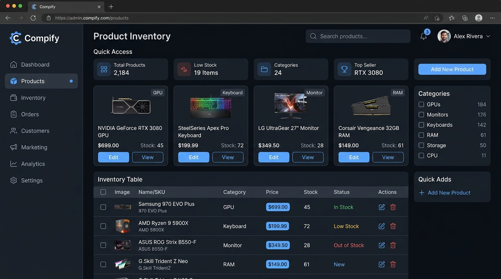
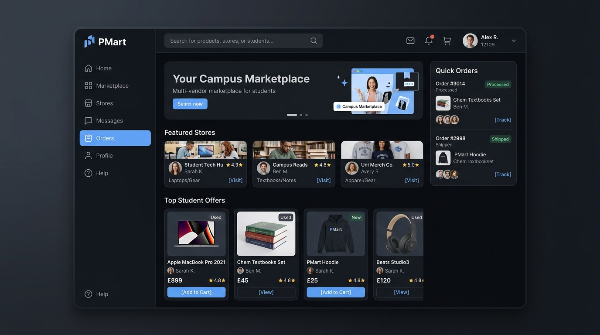
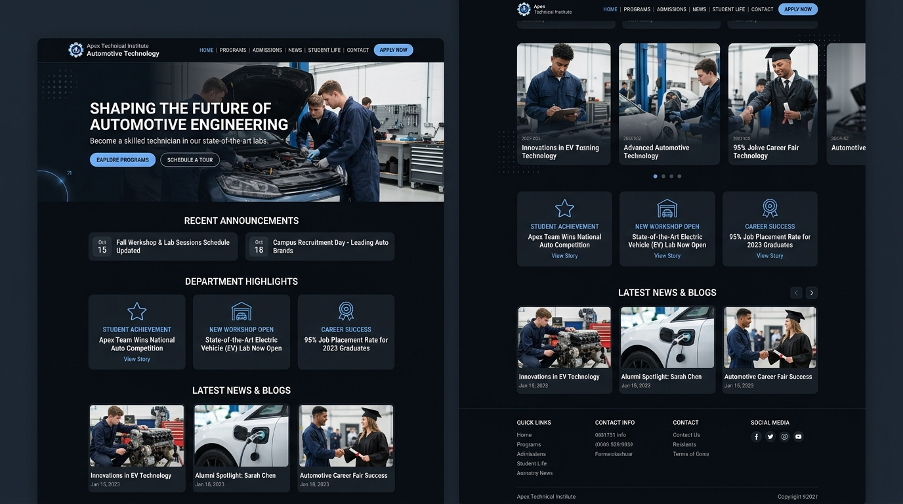

<!-- Hero Banner -->

  

    

  <h1>Hi, I'm Rayy</h1>

  
<strong>Software & Game Development Student · Backend Development Focus</strong>

  
Building web applications, learning backend architecture, and database design.

   

  
  &ensp;
  
  &ensp;
  

<!-- About Me -->
### About Me

<table>
<tr>
<td width="72%" valign="top">

I'm a vocational high school student majoring in **Software & Game Development**, focusing on backend development and building structured, maintainable web applications.

 

- **Status**: Software & Game Development Student
- **Focus**: Backend Architecture · RESTful APIs · Database Design
- **Core Stack**: PHP · Laravel · Livewire · MySQL
- **Also Working With**: Dart · Flutter · Filament
- **Portfolio**: [ast-luna.com](https://ast-luna.com)

</td>
<td width="28%" align="center" valign="middle">
  
</td>
</tr>
</table>

<!-- GitHub Statistics & Activity -->

### GitHub Statistics

&ensp;

  

  

<!-- Tech Stack -->

### ⚔ Languages · Frameworks · Tools ⚔

 

<!-- Featured Projects -->

### Featured Projects

<table>
<tr>
<td width="33%" valign="top">

  
    
  <strong>Compify</strong>
   
  <code>Laravel</code> · <code>Livewire</code> · <code>MySQL</code>

 

Hardware e-commerce platform featuring product filtering, cart, wishlist, and admin management.

 

  <a href="REPOSITORY_URL_COMPIFY"><code>View Repository ▸</code></a>

</td>

<td width="33%" valign="top">

  
    
  <strong>PMart</strong>
   
  <code>Laravel</code> · <code>Filament</code> · <code>MySQL</code>

 

Multi-vendor campus marketplace with seller dashboards, catalog management, and order processing.

 

  <a href="REPOSITORY_URL_PMART"><code>View Repository ▸</code></a>

</td>

<td width="33%" valign="top">

  
    
  <strong>Teknik Otomotif</strong>
   
  <code>Laravel</code> · <code>Filament</code> · <code>MySQL</code>

 

Department portal managing announcements, academic info, industry partnerships, and student achievements.

 

  <a href="REPOSITORY_URL_OTOMOTIF"><code>View Repository ▸</code></a>

</td>
</tr>
</table>

<!-- Current Focus -->

### Current Focus

<code>Backend Architecture</code> &ensp;•&ensp;
<code>RESTful API Design</code> &ensp;•&ensp;
<code>Database Normalization</code> &ensp;•&ensp;
<code>Clean Code Principles</code> &ensp;•&ensp;
<code>Laravel Best Practices</code>

<!-- Footer -->

Made with 💙 by **Rayy**

  

