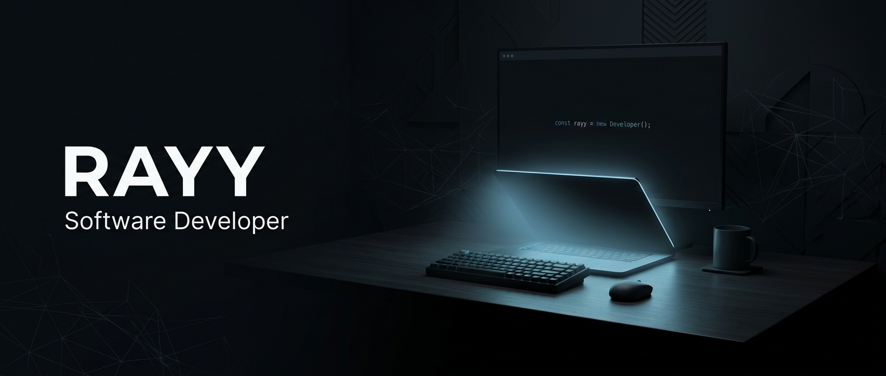
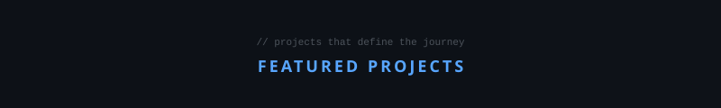

<!-- ═══════════════════════════════════════════════════════════════ -->
<!-- HERO BANNER                                                   -->
<!-- ═══════════════════════════════════════════════════════════════ -->

<div align="center">



<br/>
<br/>

<!-- Subtitle -->


<br/>
<br/>

<samp>Building web applications, learning backend development, and turning ideas into practical software.</samp>

<br/>
<br/>

<!-- Social Links -->
[](https://github.com/rayyanqatrunada)&nbsp;&nbsp;
[](https://ast-luna.com)&nbsp;&nbsp;
[](LINKEDIN_URL)

</div>

<br/>

<!-- ═══════════════════════════════════════════════════════════════ -->
<!-- SEPARATOR                                                     -->
<!-- ═══════════════════════════════════════════════════════════════ -->


<br/>

<!-- ═══════════════════════════════════════════════════════════════ -->
<!-- ABOUT ME                                                      -->
<!-- ═══════════════════════════════════════════════════════════════ -->

## &nbsp;`👨‍💻`&ensp;About Me

<table>
<tr>
<td width="65%">

I'm a **Software & Game Development** student interested in backend development and building practical web applications.

My current focus is **Laravel**, **PHP**, **MySQL**, backend architecture, database design, and learning better software engineering practices.

&nbsp;

```
🎓  Software & Game Development Student
💻  Backend Development
🚀  Laravel / PHP / MySQL
🛠️  Web Application Development
📚  Constantly Learning
```

</td>
<td width="35%" align="center">

<!-- Replace with your own profile art / illustration -->


</td>
</tr>
</table>

<br/>


<br/>

<!-- ═══════════════════════════════════════════════════════════════ -->
<!-- FEATURED PROJECTS                                             -->
<!-- ═══════════════════════════════════════════════════════════════ -->

<div align="center">

</div>

<br/>

<!-- ──────────── Project 1: Compify ──────────── -->

<table>
<tr>
<td width="50%" align="center">


</td>
<td width="50%">

### 🖥️&ensp;Compify

<samp>Computer equipment e-commerce platform</samp>

<br/>

`Laravel`&ensp;`Livewire`&ensp;`PHP`&ensp;`MySQL`

<br/>

- Product management & categories
- Brand organization
- Shopping cart & wishlist
- Product discovery
- Admin dashboard

<br/>

[`📂 View Repository`](REPOSITORY_URL_COMPIFY)

</td>
</tr>
</table>

<br/>

<!-- ──────────── Project 2: PMart ──────────── -->

<table>
<tr>
<td width="50%">

### 🏪&ensp;PMart

<samp>Multi-store marketplace for vocational school students</samp>

<br/>

`Laravel`&ensp;`Filament`&ensp;`PHP`&ensp;`MySQL`

<br/>

- Multi-shop management
- Seller & product management
- Order processing
- Marketplace workflow
- Admin dashboard

<br/>

[`📂 View Repository`](REPOSITORY_URL_PMART)

</td>
<td width="50%" align="center">


</td>
</tr>
</table>

<br/>

<!-- ──────────── Project 3: Teknik Otomotif ──────────── -->

<table>
<tr>
<td width="50%" align="center">


</td>
<td width="50%">

### 🔧&ensp;Teknik Otomotif Website

<samp>Vocational school automotive department information system</samp>

<br/>

`Laravel`&ensp;`Filament`&ensp;`PHP`&ensp;`MySQL`

<br/>

- Announcements & academic info
- Achievement records
- Industry partnerships
- Alumni network
- Media & document management

<br/>

[`📂 View Repository`](REPOSITORY_URL_OTOMOTIF)

</td>
</tr>
</table>

<br/>


<br/>

<!-- ═══════════════════════════════════════════════════════════════ -->
<!-- GITHUB STATISTICS                                             -->
<!-- ═══════════════════════════════════════════════════════════════ -->

## &nbsp;`📊`&ensp;GitHub Statistics

<div align="center">

<a href="https://github.com/rayyanqatrunada">

</a>
&nbsp;&nbsp;&nbsp;
<a href="https://github.com/rayyanqatrunada">

</a>

<br/>
<br/>

<a href="https://github.com/rayyanqatrunada">

</a>

</div>

<br/>


<br/>

<!-- ═══════════════════════════════════════════════════════════════ -->
<!-- CONTRIBUTION ACTIVITY                                         -->
<!-- ═══════════════════════════════════════════════════════════════ -->

## &nbsp;`📈`&ensp;Contribution Activity

<div align="center">

<a href="https://github.com/rayyanqatrunada">

</a>

</div>

<br/>


<br/>

<!-- ═══════════════════════════════════════════════════════════════ -->
<!-- TECH STACK                                                    -->
<!-- ═══════════════════════════════════════════════════════════════ -->

<div align="center">

</div>

<br/>

<div align="center">

#### Languages

&ensp;
&ensp;
&ensp;


<br/>

#### Frameworks

&ensp;
&ensp;
&ensp;


<br/>

#### Tools

&ensp;
&ensp;
&ensp;


</div>

<br/>


<br/>

<!-- ═══════════════════════════════════════════════════════════════ -->
<!-- CURRENTLY LEARNING                                            -->
<!-- ═══════════════════════════════════════════════════════════════ -->

## &nbsp;`🌱`&ensp;Currently Learning

<table>
<tr>
<td>

```
▸ Backend Architecture          ▸ REST API Development
▸ Database Design               ▸ Authentication & Authorization
▸ Clean Code Practices          ▸ Laravel Best Practices
▸ Software Engineering Principles
```

</td>
</tr>
</table>

<br/>


<br/>

<!-- ═══════════════════════════════════════════════════════════════ -->
<!-- DEVELOPER JOURNEY                                             -->
<!-- ═══════════════════════════════════════════════════════════════ -->

<div align="center">

## &nbsp;`🎯`&ensp;Developer Journey

<br/>

> *Turning ideas into software, one project at a time.*

<br/>

```
Build  →  Learn  →  Improve  →  Repeat
```

</div>

<br/>


<br/>

<!-- ═══════════════════════════════════════════════════════════════ -->
<!-- CONNECT                                                       -->
<!-- ═══════════════════════════════════════════════════════════════ -->

<div align="center">

## &nbsp;`🌐`&ensp;Connect With Me

<br/>

[](https://github.com/rayyanqatrunada)&ensp;
[](https://ast-luna.com)&ensp;
[](LINKEDIN_URL)

</div>

<br/>

<!-- ═══════════════════════════════════════════════════════════════ -->
<!-- FOOTER                                                        -->
<!-- ═══════════════════════════════════════════════════════════════ -->

<div align="center">


<br/>


</div>
